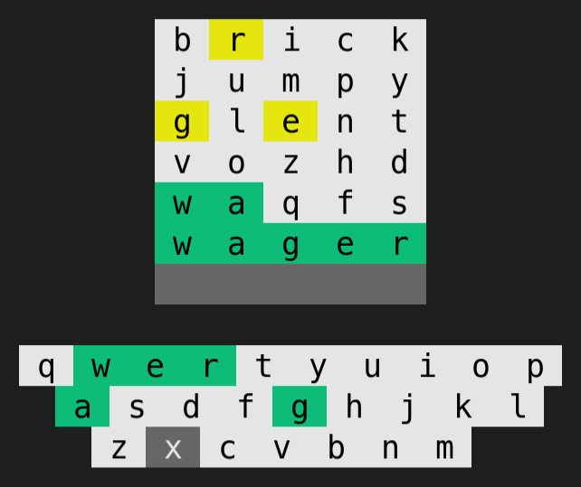

# WORDLE

## Installation

Requires `node>=16`

### CLI

 Play without installing
```bash
npx @aryan02420/wordle
```

Install globally
```bash
npm i -g @aryan02420/wordle
wordle
```

<details>
<summary>
Install locally (not recommended)
</summary>

```bash
npm i @aryan02420/wordle
./node_modules/.bin/wordle
```

</details>

<p align="center">
  
</p>

### GitHub Actions

- Create `<user>/<repo>/.github/workflows/wreadle.yml`

  ```yml
  name: 'Wreadle'

  on:
    repository_dispatch:
      # change this
      types: [my-event-name]

  jobs:
    wordle:
      runs-on: ubuntu-latest
      steps:
        - name: Cancel Previous Runs
          uses: styfle/cancel-workflow-action@0.10.0
          with:
            # automatically generated by github
            access_token: ${{ github.token }}

        - name: Checkout
          uses: actions/checkout@v3

        - name: Wreadle
          uses: aryan02420/wreadle@v0.1
          id: wreadle
          with:
            # path to your readme file relative to root
            readme: ./README.md
            # tag used to identify wreadle section
            tag: wreadle
            # url of the server authorized to create dispatch event
            serverUrl: https://myserver.com/dispatch

        - name: commit
          run: |
            git config --local user.name 'github-actions[bot]'
            git config --local user.email 'github-actions[bot]@users.noreply.github.com'
            git commit -am '🐛 Wordle update!' | true
            git push

  ```

- Update readme. `wreadle` is the tag from above.

  ```md
  <!--START_SECTION:wreadle-->
  <!--END_SECTION:wreadle-->
  ```

### Server

#### Hosting locally

- Create a `.env` file.
  ```sh
  cp .env.example .env
  ```

- Create a new Personal Access Token with the repo scope. Update the `.env` file with this token. Click the link below to create a new PAT.

  https://github.com/settings/tokens/new?scopes=repo

- Run the server

  ```sh
  npm run dev:start
  ```

> NOTE:
> if using this hosting method, `serverUrl` in github workflow file should be `<myserver.com>/dispatch`

#### Hosting on a server

- Set the environment variables listed in `.env.example` file

- Run the server script

  ```sh
  npm run start
  ```

#### Hosting on deno deploy

- Create a new empty project

  https://dash.deno.com/new &nbsp;&nbsp; > &nbsp;&nbsp; `+ Empty Poject`


- Create a deployment using [deployctl](https://deno.com/deploy/docs/deployctl#deployctl-cli)

  ```sh
  deployctl deploy --project=<myproject> --no-static https://raw.githubusercontent.com/aryan02420/wordle/main/deno/index.ts
  ```

- Set the `GITHUB_TOKEN` environment variable

> NOTE:
> if using this hosting method, `serverUrl` in github workflow file should be `myproject.deno.dev`

### Github App

TODO
